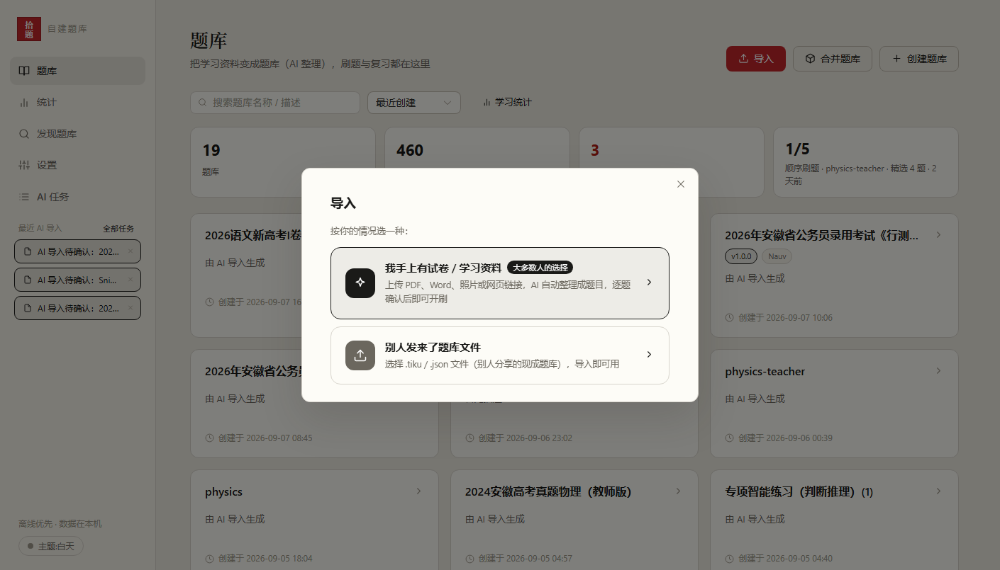
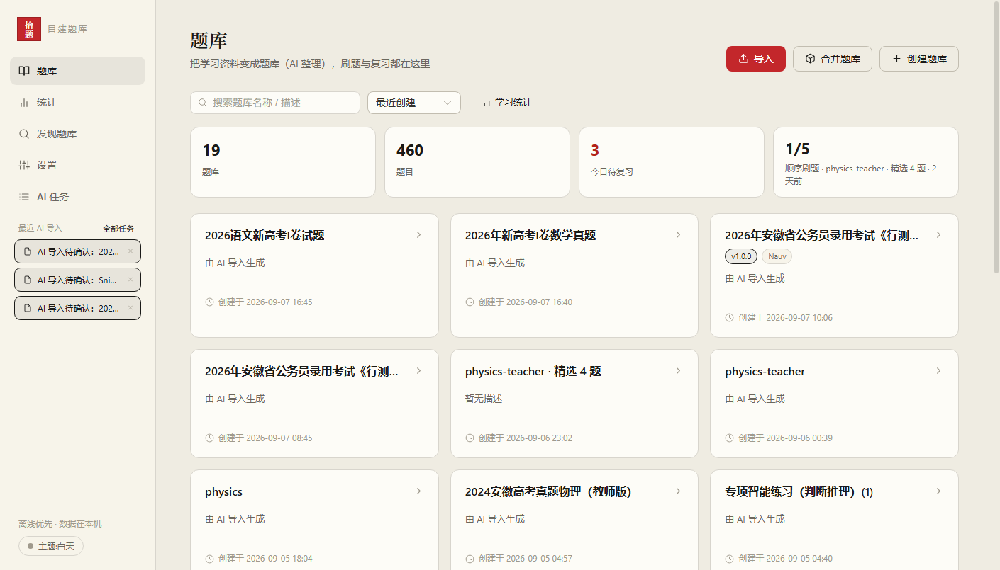
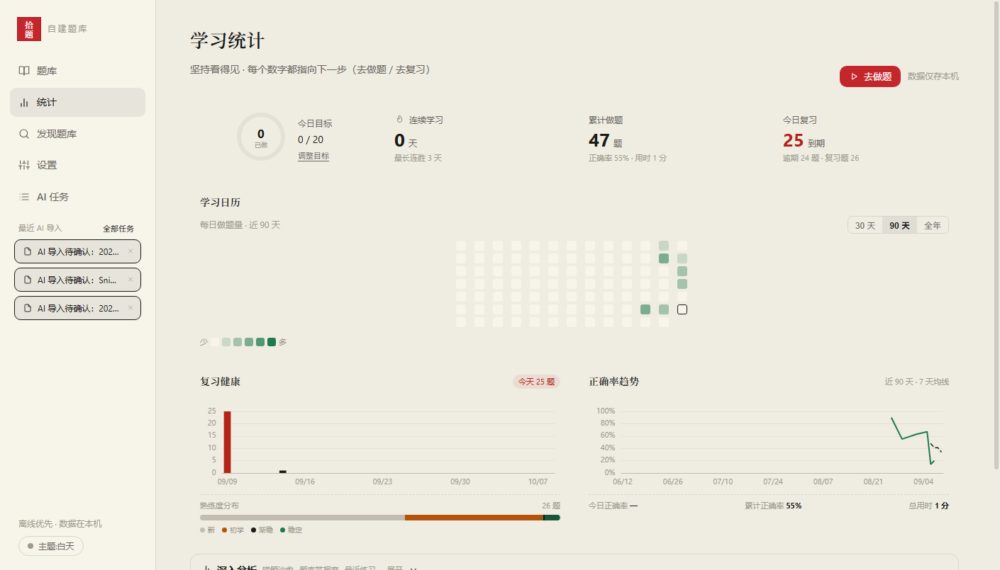

<p align="center">
  
</p>

<h1 align="center">ShiTi (PickQ) · Turn Your Study Materials into a Question Bank You Can Practice</h1>

<p align="center">
  <b>Turn the materials you already have into quizzes you can drill.</b><br/>
  PDF / Word / photos → AI turns them into questions; practice, review and stats all live on your machine.
</p>

<p align="center">
  <a href="README.md">中文</a> · <b>English</b>
</p>

<p align="center">
  
  
  <a href="https://pickq.cn"></a>
</p>

---

## Table of Contents

- [What is this](#what-is-this)
- [Why PickQ](#why-pickq)
- [How to use](#how-to-use)
- [Share your question banks](#share-your-question-banks)
- [Getting started](#getting-started)
- [Architecture](#architecture)
- [Repository layout](#repository-layout)
- [FAQ](#faq)
- [License](#license)

---

## What is this

PickQ is a Windows desktop app: upload the study materials you already have (lecture PDFs, scanned past papers, photos of mistakes, Word / txt files), and AI turns them into well-formed questions (single choice, multiple choice, true/false, subjective, etc.). Review each question, confirm, and start practicing. Answers, mistakes and review schedules are stored locally — no account required, works offline.

## Why PickQ

Question-bank tools generally fall into two camps: you use someone else's bank (content you don't control), or you build your own (manual entry, slow). Some newer tools add AI-assisted conversion, but few handle image-heavy materials well. PickQ targets three concrete scenarios:

- **Image-heavy materials don't lose their images**: images in scans, charts and screenshots are preserved and appear in the question stem, options or materials where they belong — through storage, export and re-import. Try it once with an image-rich paper and see for yourself;
- **Your materials never leave your machine**: AI conversion uses an API key you obtain yourself (OpenAI, DeepSeek, Anthropic, Google Gemini, etc., or a local Ollama). Source materials, questions and records stay on your machine;
- **Your data is plain files**: a question bank exports as a single file (.tiku / .json). Backup, switching computers and sharing never depend on any account or service.

## How to use

### Way 1: Turn your materials into a question bank (most common)

1. On the home page click **Import** → choose "I have papers / study materials";
2. Upload PDF / Word / images, pick a model (first time: fill in your API key under Settings → AI Model, with step-by-step guides inside the app);
3. Review questions one by one in the preview (edit options, fill answers, handle images) → confirm → start practicing.



### Way 2: Import a question-bank file someone shared

Got a .tiku / .json file? Click **Import** → "Someone sent me a bank file". Duplicate imports are detected automatically.

### Way 3: Use an existing bank right away

The **Discover** page browses the community plaza (pickq.cn) and imports a bank in one click.

### Day-to-day

- **Practice**: session-based — answer a set of questions, then submit for unified scoring; answer sheet, mistakes and favorites included;
- **Review**: due reminders based on a memory schedule, so "learned it but forgot it" becomes rare;
- **Stats**: accuracy trends, whether mistakes are actually healed, review distribution — all reviewable.

　

## Share your question banks

A question bank's value lies not in who owns it, but in how many people it has helped.

PickQ returns question banks to what they were meant to be: ordinary files that flow freely. Sharing has no barriers —

- **Send it directly to someone**: export a .tiku file; chat windows, cloud drives and USB sticks all work; the receiver imports and starts practicing;
- **Publish it to the community plaza**: strangers can find it through search and favorites (pickq.cn, free to publish, no account binding required);
- **Any channel you already use**: QQ groups, blogs, campus forums… as long as the file arrives, sharing happens.

Every bank in the plaza began with someone who took the time to organize. If you have benefited from others' shared banks, share what you have carefully organized too — the more people share, the less finding good material feels like luck, and the people who organize carefully will eventually be seen by more people.

## Getting started

### Download the desktop app

Installers and a portable zip (unzip and run) are available at <https://pickq.cn>

Users on older versions get an in-app update prompt when they open the app (auto-update is built in since v0.1.1).

### Build from source

```bash
# 1. Frontend build (bundled into the backend jar's static/)
cd frontend && npm install && npm run build

# 2. Backend package & run (Java 21 + Maven)
mvn package -DskipTests
java -jar target/Tiku-0.0.1-SNAPSHOT.jar    # http://localhost:8080
```

One-command Windows desktop packaging:

```powershell
.\tauri\build-desktop.ps1   # backend jar → jlink JRE → NSIS installer + portable zip
```

Data directory defaults to `~/.tiku` (H2 database + images + AI config); override with the `TIKU_DATA_DIR` environment variable.

## Architecture

```
tiku-desktop.exe (Tauri 2 / Rust shell)
  ├─ single instance, random port, parent-process guard
  └─ bundles a trimmed JRE + Spring Boot jar (local H2 database, serves the Vue frontend)
        ↓ http://127.0.0.1:random-port
     WebView2 window
```

- Backend: Spring Boot 3 / Java 21 / MyBatis-Plus / H2 / Flyway
- Frontend: Vue 3 + Element Plus + ECharts (SPA, served by the backend)
- Desktop shell: Tauri 2 (Rust), bundles a trimmed JRE — users don't install Java
- Auto-update and one-click backup/restore are implemented by the shell together with the backend

## Repository layout

```
src/          Backend (Spring Boot)
frontend/     Frontend SPA
tauri/        Desktop shell & packaging scripts
docs/         Logo & screenshots
```

> The website (Nuxt3), deployment scripts and design docs are internal assets and are not part of this repository.

## FAQ

- **What do I need for AI conversion?** A model API key (OpenAI / DeepSeek / Anthropic / Gemini etc. — a few dollars to start; or local Ollama at zero cost). The key is stored only on your machine.
- **How do I move to a new computer?** Settings → Full Backup downloads a backup file; on the new machine, "Restore from backup" and the app does the rest automatically.
- **Is it free?** The app is free. AI usage is paid through your own API key.

## License

[MIT](LICENSE)
