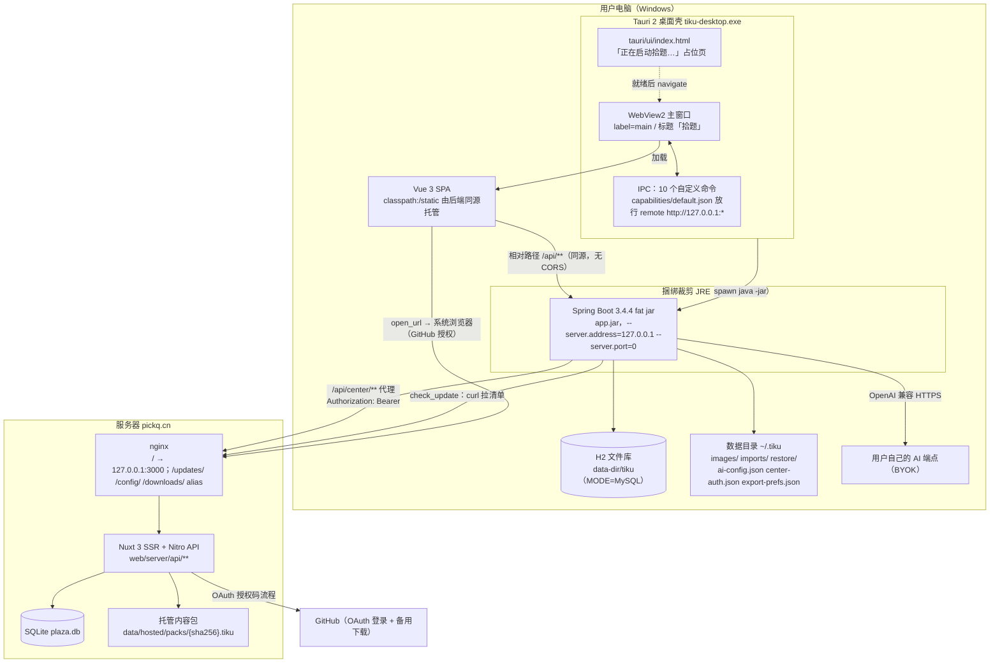
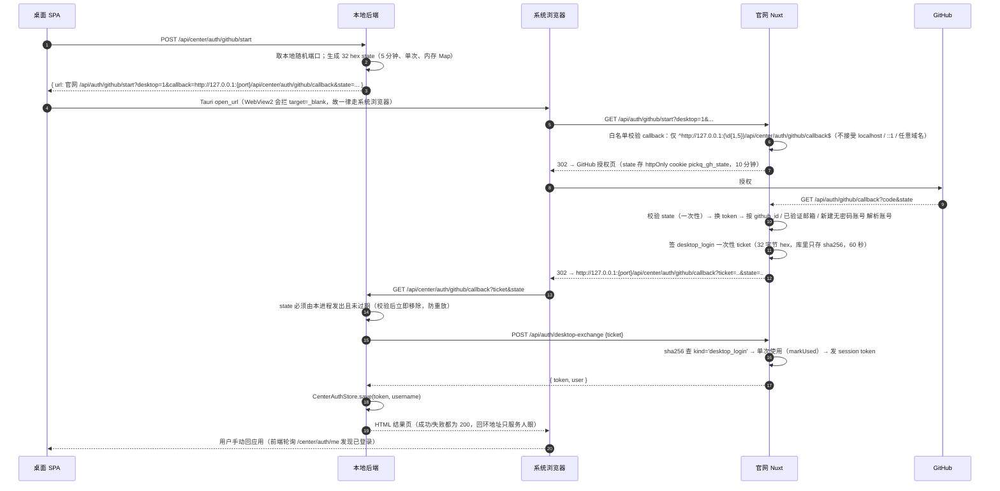
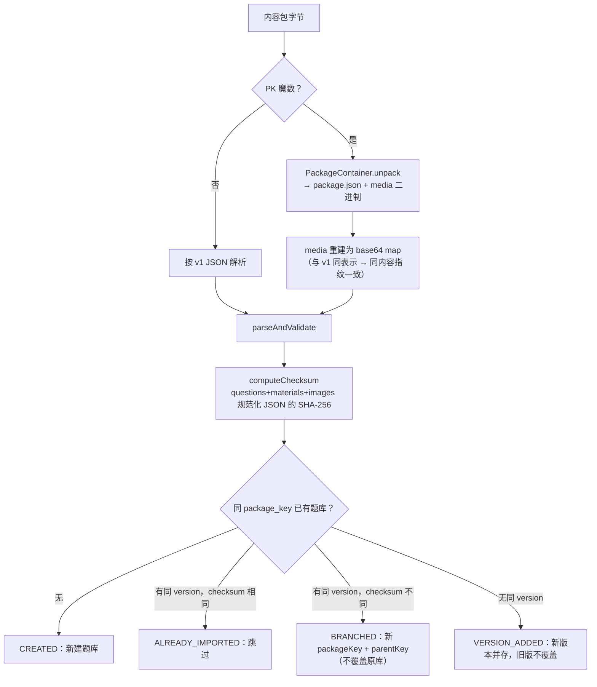
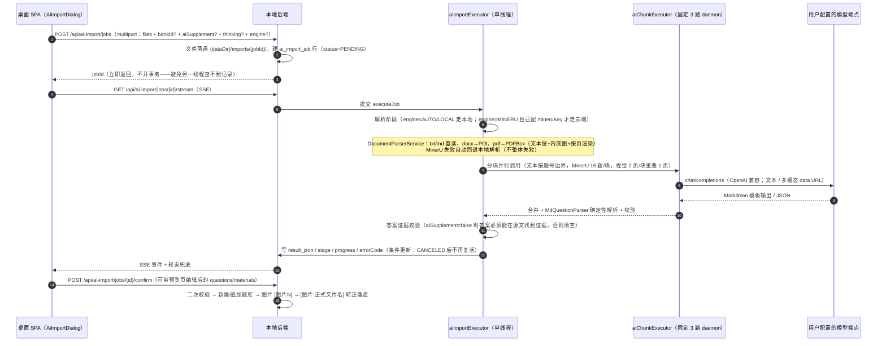
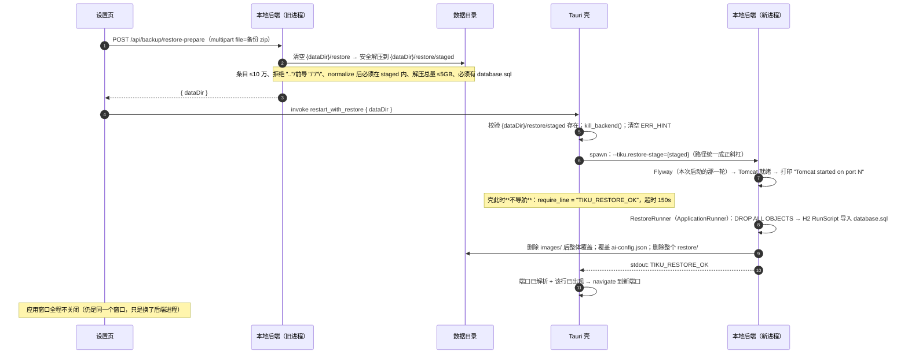
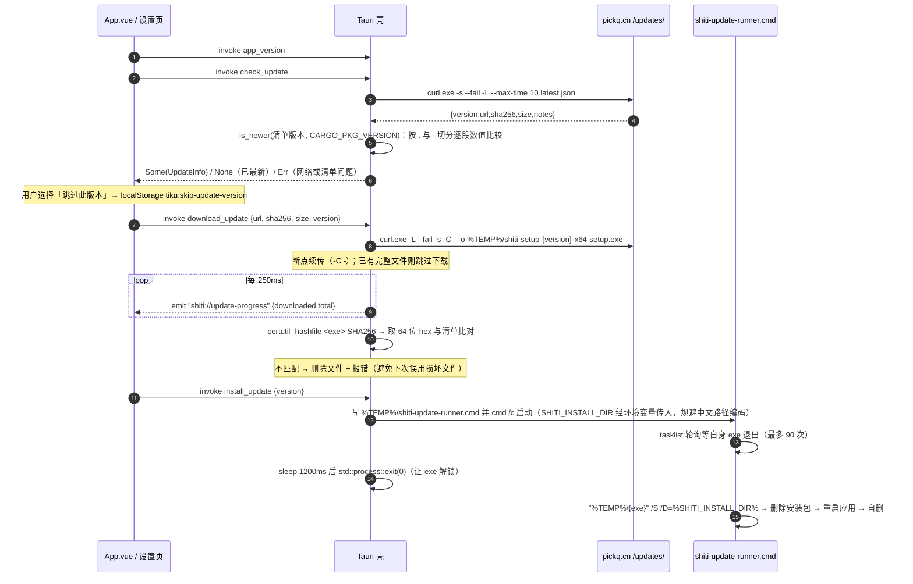
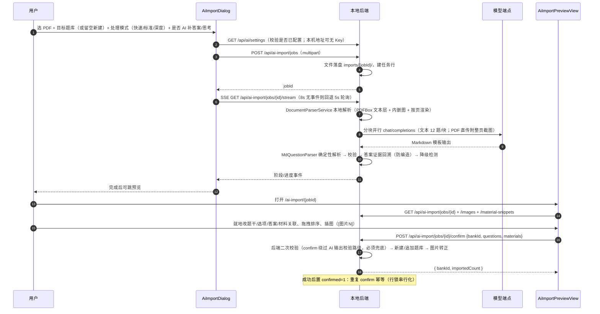
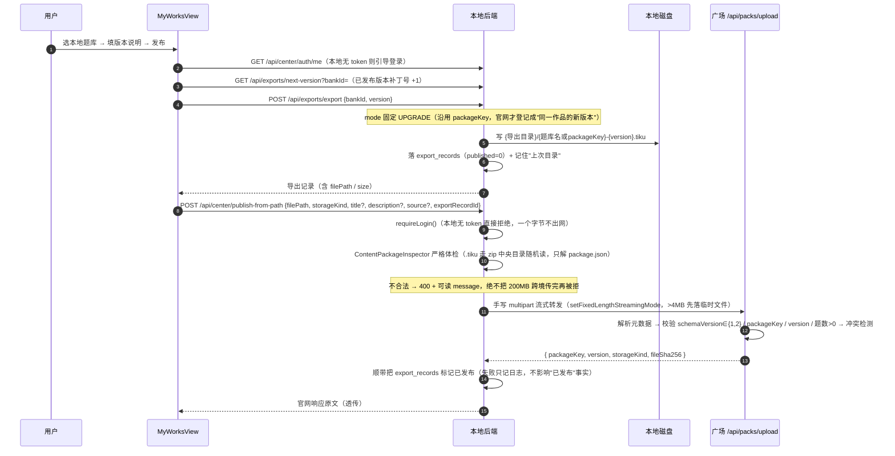
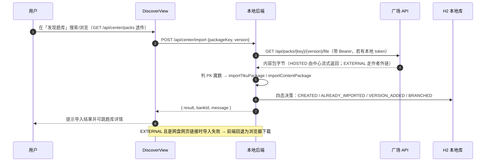

# 架构与关键机制

> 本文描述**拾题（PickQ）当前代码实际运行的架构**。所有结论均来自本仓库代码，每节标注来源文件；
> 代码里找不到依据的一律写「待确认」，不做推测。
>
> 相关文档（分工，避免重复）：
> - 业务规则与功能地图 → [`features.md`](features.md)
> - 内容包字段级契约 → [`package-format.md`](package-format.md)（**跨端契约**）
> - 表结构、数据目录、迁移 → [`data-model.md`](data-model.md)
> - 编码与分层约定（含反例）→ [`conventions.md`](conventions.md)
> - 功能 → 代码位置对照 → [`code-map.md`](code-map.md)
> - Android 端设计稿 → [`design-mobile.md`](design-mobile.md)
>
> 事实来源（本文只依据这些文件）：`tauri/src-tauri/src/main.rs`、`tauri/src-tauri/tauri.conf.json`、
> `tauri/src-tauri/Cargo.toml`、`tauri/src-tauri/capabilities/default.json`、`tauri/build-desktop.ps1`、
> `pom.xml`、`src/main/{java,resources}/**`、`frontend/src/**`、`frontend/vite.config.js`、
> `web/{nuxt.config.ts,server/**,pages/**,composables/**,layouts/**}`、`scripts/deploy/**`、`deploy/publish-update.ps1`、`.gitignore`。

---

## 1. 总览

系统由**两条互不依赖、只通过 HTTP 契约耦合**的主线构成：

| 主线 | 形态 | 代码位置 | 是否入 git |
| --- | --- | --- | --- |
| **桌面应用** | Tauri 2 壳 + 捆绑裁剪 JRE + 本地 Spring Boot fat jar + H2 文件库 + Vue 3 SPA（由后端同源托管） | `tauri/`、`src/main/`、`frontend/src/` | 是 |
| **官网 / 题库广场** | Nuxt 3 全栈（SSR 页面 + Nitro API）+ SQLite（better-sqlite3） | `web/` | **否**（`.gitignore` 第 58 行 `web/`） |



### 1.1 两条主线之间的全部通信面

| 方向 | 通道 | 端点 / 地址 | 鉴权 | 来源 |
| --- | --- | --- | --- | --- |
| SPA → 本地后端 | 同源 HTTP（WebView 内），axios `baseURL: '/api'` | `/api/**` | **无**（只监听回环，见 §4.1） | `frontend/src/api/http.js:11`、`tauri/src-tauri/src/main.rs:172-173` |
| 本地后端 → 广场 | 服务端到服务端的 HTTP 代理（`HttpURLConnection`，统一在 `CenterHttpClient`） | `/api/center/**` → `{center}/api/**`，`center` 缺省 `https://pickq.cn` | `Authorization: Bearer <token>`（token 由本地后端持有，前端不接触） | `CenterProxyController`、`CenterPublishController`、`CenterAuthController`、`CenterHttpClient.attachAuth` |
| WebView → 壳 | Tauri IPC | 10 个命令（见 §4.6） | capabilities `remote.urls = ["http://127.0.0.1:*"]` | `tauri/src-tauri/capabilities/default.json:5-8` |
| 壳 → 更新频道 | `curl.exe` 拉静态清单 | `https://pickq.cn/updates/latest.json` | 无（HTTPS + SHA256 校验） | `tauri/src-tauri/src/main.rs:19`、`scripts/deploy/pickq-nginx.conf:21-23` |
| 本地后端 → AI 服务商 | HTTPS（OpenAI 兼容） | 用户自填 `baseUrl`（BYOK） | 用户自己的 Key（或用本机 Ollama 免 Key） | `AiClientService.java`、`AiConfigService.java:102-116` |
| 本地后端 → 远端配置 | HTTP 透传 + 内存缓存 1h | `https://pickq.cn/config/ai-presets.json` | 无 | `AiPresetService.java`、`docs/release-notes-guide.md:60-73` |
| 桌面端 → 广场（下载） | 代取字节后直接导入 | `/api/packs/{key}/{version}/file` | 有 token 才带 Bearer | `CenterProxyController` 的导入端点 + `CenterHttpClient.getBytes` |
| 桌面端 → 广场（发布） | 手写 multipart 流式转发 | `POST /api/packs/upload` | Bearer（本地无 token 直接拒绝） | `CenterPublishController.publish` → `CenterPublishService.publish` → `CenterHttpClient.forwardMultipart` |

> 说明：本文件里带 `:行号` 的引用是**写入时的快照**，重构后可能漂移；判断行为请以**符号名（方法 / 常量 / 类）**为准。

**广场域名是硬编码常量，不提供用户自定义**：`frontend/src/utils/center.js:7` 的 `CENTER_URL = 'https://pickq.cn'`（后端的 `center` 参数默认值同样为 `https://pickq.cn`，且只做「http(s) + 不含 `@`」的格式校验，见 `CenterProxyController.java:52-61`）。历史遗留的 localStorage 覆盖值被显式忽略。

---

## 2. 桌面端启动链路

### 2.1 时序

```mermaid
sequenceDiagram
  autonumber
  participant U as 用户
  participant EXE as tiku-desktop.exe（Tauri 壳）
  participant WIN as WebView2 主窗口 main
  participant JVM as java.exe（app.jar）
  participant H2 as H2 文件库

  U->>EXE: 双击快捷方式 / exe
  EXE->>EXE: CreateMutexW("cn.shiti.desktop.single.instance")
  alt 已有实例（ERROR_ALREADY_EXISTS）
    EXE->>WIN: FindWindowW("拾题") → ShowWindow(SW_RESTORE) → SetForegroundWindow
    EXE-->>U: 本进程 exit(0)（静默退出，不报「数据库被占用」）
  else 首次实例
    EXE->>WIN: 窗口立即创建，先显示 tauri/ui/index.html 占位页
    Note over EXE,WIN: bundle.frontendDist = "../ui"，不是 Vue SPA
    EXE->>EXE: 后台线程 locate_resources(resource_dir)
    EXE->>JVM: spawn：-Dtiku.watch-parent=true -jar app.jar [--tiku.data-dir=..] --server.address=127.0.0.1 --server.port=0
    Note over EXE,JVM: CREATE_NO_WINDOW（Java 是控制台程序，禁止弹黑窗）
    JVM->>JVM: 启动父进程守护线程（每 2s 检查 ProcessHandle.parent().isAlive()）
    JVM->>JVM: Flyway 迁移 db/migration/V1..V14
    JVM->>H2: 打开 jdbc:h2:file:{data-dir}/tiku;MODE=MySQL
    JVM-->>EXE: stdout: "Tomcat started on port 12345 (http) with context path '/'"
    EXE->>EXE: 解析端口（超时 45s；失败→kill_backend + 错误窗口）
    EXE->>WIN: navigate("http://127.0.0.1:12345/")
    WIN->>JVM: GET / → classpath:/static/index.html（Vue SPA）
    JVM-->>WIN: SPA 加载 → axios 相对路径 /api/** 同源请求
  end
```

### 2.2 逐步说明与依据

| 步 | 行为 | 依据 |
| --- | --- | --- |
| 1 | 编译为 Windows 子系统程序（无控制台窗口）；`main()` 第一件事是单实例判定 | `main.rs:4`（`windows_subsystem = "windows"`）、`:809-814` |
| 2 | 单实例用**手写 Win32**（`CreateMutexW` / `FindWindowW` / `ShowWindow` / `SetForegroundWindow`），零新依赖；互斥句柄 `std::mem::forget` 保持到进程退出，靠 OS 回收 | `main.rs:21-66`，注释在 `:22` |
| 3 | 已有实例时按**主窗口标题「拾题」**精确查找后激活（错误窗口标题带「启动失败」后缀，不会误中） | `main.rs:55-64` |
| 4 | Tauri builder 注册 10 个命令；`.setup()` 里 `launch_backend(&handle, extra, None)` 并立即返回，**不阻塞窗口显示** | `main.rs:815-843` |
| 5 | 环境变量 `TIKU_DATA_DIR` 非空时追加 `--tiku.data-dir=<dir>`（测试实例 / 便携数据随行） | `main.rs:832-840` |
| 6 | `locate_resources` 按候选顺序定位 JRE 与 jar：`resource_dir/jre/bin/java.exe` → `resource_dir/resources/jre/...` → `cwd/resources/jre/...`；jar 同理（`resource_dir/app.jar` → `resource_dir/resources/app.jar` → `cwd/resources/app.jar`）。找不到即报可读中文错误 | `main.rs:117-150` |
| 7 | 后端命令行固定为 `-Dtiku.watch-parent=true -jar <jar> [extra...] --server.address=127.0.0.1 --server.port=0` | `main.rs:164-173` |
| 8 | stderr 由独立线程逐行消费（防管道阻塞）：写入壳日志，并抓关键失败原因（`already in use` / `locked by another process` / `database may be already in use` → 「数据文件正被另一个拾题实例占用…」；首个含 `exception`/`error` 的行 → 「后端异常：…」） | `main.rs:189-209` |
| 9 | stdout 逐行解析就绪行 `Tomcat started on port <n>`（`main.rs:223` 的注释即此字符串），取第一个 token 转 `u16` | `main.rs:217-236` |
| 10 | 就绪超时：正常启动 **45s**；带 `require_line`（恢复模式）为 **150s**。提前退出或 `APPLICATION FAILED TO START` / `Application run failed` 都会 `kill_backend()` 后返回错误 | `main.rs:217-255` |
| 11 | 就绪后 `handle.get_webview_window("main").navigate("http://127.0.0.1:{port}/")` | `main.rs:884-891` |
| 12 | 主窗口先显示的是 `bundle.frontendDist = "../ui"` 指向的**占位页**（`tauri/ui/index.html`，纯静态「正在启动拾题…」+ 转圈），真正的界面是后端同源托管的 Vue SPA | `tauri.conf.json:7`、`tauri/ui/index.html` |
| 13 | 启动失败不导航，而是**新建** label 为 `error` 的窗口加载 `error.html`（标题 `拾题启动失败：<前 80 字>`，660×480、不可缩放、居中）；**刻意不 hide/destroy 主窗口**（注释说明 hide 会竞态触发 `CloseRequested` 导致错误窗口来不及展示） | `main.rs:892-916` |

### 2.3 壳与后端的生命周期绑定（三重保护）

| 机制 | 实现 | 意图 |
| --- | --- | --- |
| 显式杀子进程 | `on_window_event` 收到 `CloseRequested` → `kill_backend()`（kill + wait）+ `app.exit(0)`；`RunEvent::Exit` 再兜底杀一次 | Tauri 2 不再默认「最后窗口关闭即退出」，且 shell 不是进程本身（launcher 模式），必须显式清理 |
| Java 侧父进程守护 | `-Dtiku.watch-parent=true` → `TikuApplication.startParentWatcher()`：daemon 线程每 2s 检查 `ProcessHandle.current().parent().isAlive()`，父进程消失即 `System.exit(0)` | 壳被强杀（任务管理器 / 崩溃）时避免 `java.exe` 残留占端口、锁 H2 |
| 壳日志 | `%APPDATA%/cn.shiti.desktop/desktop.log`，追加写入，记录 spawn 命令行、后端 stdout/stderr 全文、navigate/失败原因 | 打包后无控制台，日志是唯一现场 |

依据：`main.rs:844-872`、`main.rs:798-805`、`TikuApplication.java:15-44`、`main.rs:83-115`。

### 2.4 随机端口与「同源」的意义

- `--server.port=0` 让 Spring Boot 由内核分配空闲端口，壳从 stdout 解析（`main.rs:172-173`、`:223-236`）。
  依赖这一点的还有**桌面 GitHub 登录的回环回调**：`CenterAuthController.localPort()` 通过
  `ObjectProvider<WebServerApplicationContext>` **延迟**取 `getWebServer().getPort()`
  （延迟获取的原因写在 `:53-58`：`@SpringBootTest` 的 MOCK 环境没有该 bean，构造期强依赖会让整个上下文加载失败）。
- 端口随机 → 前端不能写死后端地址。因此**前端产物由后端同源托管**：Vite 构建出 `frontend/dist`，
  根 `pom.xml` 用一份 `<resource>` 把它拷进 `classpath:/static`（`pom.xml:95-100`），
  axios 的 `baseURL: '/api'` 在开发（Vite 代理到 `localhost:8080`）与生产（同源）下都不变
  （`frontend/vite.config.js:4-16`、`frontend/src/api/http.js:11`）。
- SPA 深链刷新由 `SpaForwardConfig` 兜底：`/**` 无扩展名且非 `api/` 前缀 → 回退 `index.html`；
  **`/api/**` 一律不回退**（未命中走 404 → `GlobalExceptionHandler` 的 `NoResourceFoundException` → JSON 错误体，前端 axios 依赖此语义）。
  依据：`SpaForwardConfig.java:23-56`（类注释标了「约束（勿破坏）」）。

---

## 3. 分层与职责

### 3.1 后端（`src/main/java/com/tiku/**`）

包结构固定：`config` / `controller` / `service` / `mapper` / `model` / `dto` / `util`。

| 层 | 文件数 / 代表 | 该放什么 | 不该放什么 |
| --- | --- | --- | --- |
| `controller` | 15 个 controller + 1 个 `@RestControllerAdvice` | 路由、参数绑定（`@RequestParam` / `@PathVariable` / `@Valid @RequestBody` / `@RequestPart`）、调 service、包 `ApiResponse`；**跨端代理类**（`Center*`）额外负责转发与远端错误文案提取 | 业务分支、直接注入 mapper、自己拼状态码 |
| `service` | 27 个 | 业务规则与**事务边界**（`@Transactional` 在这里），编排多个 mapper；跨库级联删除、判分、复习调度、内容包序列化都在这层 | HTTP 概念（`ResponseEntity`、`MultipartFile` 只在少数 controller/服务边界出现） |
| `mapper` | 9 个 | MyBatis-Plus `BaseMapper<T>` **空接口是常态**；只有需要 SQL 特性才写注解 SQL（只有 3 个 mapper 写了：`PracticeSessionMapper` / `AiImportJobMapper` 的 `FOR UPDATE` 行锁、`PracticeSessionQuestionMapper` 的关联查询与级联删除） | XML mapper（`resources` 下无 `mapper-locations`，全仓 0 个 `*.xml`） |
| `model` | 16 个 | 持久化实体（`@Data` + `@NoArgsConstructor` + `@TableName` + `@TableField`）、枚举、`OptionItemTypeHandler` 类型处理器 | 对外 JSON 形状（那是 `dto` 的事） |
| `dto` | 64 个文件 / 73 个 record | **全部是 `record`**；`XxxRequest` / `XxxResponse` 成对命名；`fromEntity(...)` 静态工厂；只服务单个响应的聚合结构用嵌套 record；**不使用 Lombok** | 可变 bean、`Map<String,Object>` 当响应 |
| `util` | 3 个 | 无状态纯工具：`PackageContainer`（.tiku 容器读写）、`NetAddress`（本机/私网判定）、`Paging`（分页参数钳制） | 依赖 Spring 容器、持有状态 |
| `config` | 6 个 | 基础设施装配：数据目录创建、SPA 回退、CORS、MyBatis-Plus、异步线程池、AI 配置 POJO | 业务规则 |

依据：`conventions.md` §1.3–1.5、`Paging.java`、`MybatisPlusConfig.java`、`SpaForwardConfig.java`、`AsyncConfig.java`。

**约定（现状惯例）**

1. **统一响应体**：controller 一律返回 `ApiResponse<T>`（`dto/ApiResponse.java`，`{code,data,message}`）。
   例外是那些**必须返回非 JSON 或必须透传原文**的接口：
   - `AiConfigController.getPresets` / `CenterProxyController` / `CenterPublishController` 的转发接口返回 `ResponseEntity<String>`（原样透传远端 JSON，避免前后端字段耦合，见 `AiConfigController.java:44-45`）；
   - `BackupController.downloadBackup` 返回 `ResponseEntity<StreamingResponseBody>`；
   - `AiImportController.readJobImage` 返回 `ResponseEntity<byte[]>`；
   - `CenterAuthController.githubCallback` 返回 **HTML**（浏览器直接访问的回环结果页，`text/html; charset=UTF-8`）。
2. **异常语义化**：业务代码按语义抛异常，状态码由 `GlobalExceptionHandler` 统一映射——
   `NoSuchElementException`→404、`IllegalArgumentException`→400（message **面向用户可读**且部分与官网同口径）、
   `IllegalStateException`→500（保留真实原因）、IO 异常仅在 SSE 等异步上下文静默 204。
3. **错误文案即契约**：`CenterProxyController` / `CenterPublishController` 抛出的中文 message 与官网
   `web/server/utils/package-meta.ts` 一一对应，改文案等于改契约（测试注释明确写了这一点）。
4. **时间由 service 显式赋值**，不用 `MetaObjectHandler`（为了「导入历史记录时保留原时间」）。

### 3.2 前端（`frontend/src/**`）

无 Pinia、无 `stores/`、无 `composables/`（目录本身不存在）。

| 目录 | 放什么 | 现有文件 |
| --- | --- | --- |
| `api/` | 薄封装，**一个后端资源一个文件**；函数体一行式 | `http.js`（唯一 axios 实例）、`banks.js`、`questions.js`、`sessions.js`、`studyRecords.js`、`materials.js`、`stats.js`、`backup.js`、`aiImport.js`、`aiConfig.js` |
| `utils/` | 纯函数与平台适配，不 import 组件、不直接弹 UI | `format.js`、`files.js`、`richText.js`、`theme.js`、`updater.js`、`external.js`、`netAddress.js`、`aiModelHelp.js`、`center.js` |
| `i18n/` | 语言基建（`index.js` 建 i18n 实例、`lang.js` 切换/持久化/Element Plus 联动） | 字典**不在**这里（见 §4.7） |
| `layouts/` | 唯一外壳 `AppLayout.vue`（侧栏、导航、AI 任务监控） | 不放业务逻辑 |
| `views/` | 路由页面，与 `router/index.js` 一一对应；**页面可以很胖** | 11 个 |
| `components/` | 被 ≥2 处用到，或本身是复杂独立交互单元 | `TikuIcon`、`QuestionNavDock`、`QuestionFormPanel`、`AiImportDialog`、`QuestionAiAnalysis`、`FieldImages`、`StatsHeatmap` |
| `styles/` | 设计令牌与全局样式（`main.css`，含「对错需图标+文字双编码」等规则） | 组件私有样式写在组件 `<style>` 里 |

**约定的判断标准是「复用范围」而不是文件长度**（`conventions.md` §3.3 明确写了这一点）。
已知偏离：`DiscoverView.vue`（13 处）与 `MyWorksView.vue`（15 处）绕过 `api/` 直接 `import http` 调 `/center/*` 与 `/exports/*`；
`QuestionNavDock.vue` 在 `components/` 下按 Element Plus 规范**不使用** `TikuIcon` 之外的图标库——这一条全体遵守（全仓无图标库依赖）。

### 3.3 官网（`web/`）

| 位置 | 放什么 | 约束 |
| --- | --- | --- |
| `web/pages/**` | 页面（Nuxt 文件路由），每个页面自带 `initSiteLang()` + `useSiteT({zh,en})` 字典 + `useSeoMeta` | 不写服务端逻辑 |
| `web/server/api/**` | Nitro 端点（文件路由 = URL）。**没有** `server/routes/**`、没有 `server/middleware/**`、没有 `server/plugins/**` | 三级鉴权：匿名 / `requireUser(event)` / `requireUser` + `isAdminUser` |
| `web/server/utils/**` | 横切能力：`auth`（会话与鉴权）、`api`（`okResp`/`apiError`/`toPackPublic`/`maskEmail`）、`github`（OAuth）、`hosted`（托管文件存储适配层）、`package-meta`（内容包元数据解析）、`mailer`、`ratelimit`、`turnstile`、`removal`（下架公共逻辑）、`admin` | 无中间件；无第三方认证/加密库（全用 `node:crypto`） |
| `web/server/db/**` | `migrate.ts`（自管迁移数组 + `schema_migrations`）、`repos.ts`（7 个 repo，863 行） | snake→camel 的转换只在 `toPackPublic` 这类映射函数里做 |
| `web/composables/**` | `useSiteI18n.ts`（自研 i18n）、`useMe.ts`（当前用户 + `isAdmin`，`useState` 共享、`refresh()` 带去重） | — |
| `web/layouts/default.vue` | 唯一布局（顶栏 + `<slot/>` + 页脚） | — |

**官网特有的约定**：`nuxt.config.ts` 的 `nitro: {}` 未指定 preset；`routeRules` 未配置；零 Nuxt 模块；
全部环境变量除 Turnstile 外都由 `process.env` 直读（**不经** `runtimeConfig`）——
即 `GITHUB_CLIENT_ID/SECRET`、`PUBLIC_BASE_URL`、`SMTP_*`、`RESEND_API_KEY`、`MAIL_FROM`、
`ADMIN_USERNAMES`、`DB_PATH`、`HOSTED_DIR`、`NODE_ENV`。

---

## 4. 关键机制

### 4.1 认证与授权

**本地后端没有鉴权——安全边界是「只监听回环」+ 单实例。**

| 事实 | 依据 |
| --- | --- |
| `pom.xml` 无 `spring-boot-starter-security`，无任何 Filter/Interceptor 做鉴权；`/api/**` 对能访问该端口的任何进程开放 | `pom.xml:32-88` |
| 壳启动后端时固定 `--server.address=127.0.0.1` + `--server.port=0` | `main.rs:172-173` |
| 后端**不**做 CORS 通配：只放行 `http://localhost:3000` 与 `http://localhost:5173`（开发用） | `WebConfig.java:14-19` |
| 第二个实例被壳的互斥锁拦下；若用户改用浏览器版直连同一个数据目录，H2 会报占用，壳把 stderr 诊断成人话提示 | `main.rs:43-65`、`:195-200` |

**广场账号（桌面端）**

```
前端表单 → 本地后端 POST /api/center/auth/login
        → 官网 POST /api/auth/login（带 X-Desktop: 1）
        → 官网响应体额外返回 token
        → 本地 CenterAuthStore 写 {dataDir}/center-auth.json（{token, username}）
        → 后续所有 /api/center/** 代理请求自动附加 Authorization: Bearer <token>
```

| 事实 | 依据 |
| --- | --- |
| token 与 username 存**明文 JSON** `{dataDir}/center-auth.json`；类注释明确「风险面与浏览器里的官网会话 cookie 相同（本机可读）」 | `CenterAuthStore` |
| **前端永远不接触 token**；代理转发时由后端附加 Authorization | `CenterAuthStore.token()`、`CenterHttpClient.attachAuth` |
| `GET /api/center/auth/status` 只回本地是否已保存登录（不发远程请求）；`GET /me` 发现官网会话已失效时会清本地 token | `CenterAuthController.status` / `.me` |
| 退出登录：尽力通知官网，再无条件清本地 | `CenterAuthController.logout` |

**广场账号（官网侧）**

| 项 | 事实 | 依据 |
| --- | --- | --- |
| 密码哈希 | `node:crypto` 的 `scryptSync`（16 字节 hex salt，64 字节 hash），存储格式 `salt:hash`；校验用 `timingSafeEqual` | `web/server/utils/auth.ts:14-25` |
| 会话 token | `randomBytes(32).toString('hex')`（64 hex）；**库里只存 `sha256(token)`**，明文只出现在 cookie / 响应体 | `auth.ts:31-35`；`sessions.token_hash` |
| Cookie | 名 `pickq_session`；`httpOnly` + `sameSite: 'lax'` + `path: '/'` + `maxAge: 30 天` + 生产 `secure` | `auth.ts:9-10`、`:37-45` |
| 续期 | 每次命中会话即滑动续期 `expires_at = datetime('now','+30 days')` | `web/server/db/repos.ts` `sessionRepo.findUserByTokenHash` |
| 凭证二选一 | `getSessionUser`：**先**读 `Authorization: Bearer`，为空再回退 cookie；两者共用同一张 `sessions` 表 | `auth.ts:51-63` |
| 封禁即时生效 | `users.banned = 1` 时 `getSessionUser` 直接返回 `null`，**不清理会话表** | `auth.ts:61`；迁移 `007_user_banned` |
| 管理员 | 环境变量 `ADMIN_USERNAMES`（逗号分隔用户名）白名单，**不落库、无角色表** | `web/server/utils/admin.ts:1-6` |
| CSRF | **没有 CSRF 令牌、没有中间件**；防护依赖 `SameSite=Lax` + `httpOnly`（写操作全是 POST/PUT/DELETE，Bearer 场景天然不受 CSRF 影响） | 全仓无 `csrf` 实现；`server/middleware/**` 不存在 |

**桌面端 GitHub 登录（RFC 8252 本地回环 + 一次性 ticket）**



依据：`CenterAuthController.java:29-39`、`:254-354`、`web/server/utils/github.ts:24-36`、`:53-71`、`web/server/api/auth/github/callback.get.ts`、`web/server/api/auth/desktop-exchange.post.ts`、`web/server/utils/auth.ts:31-35`。

**待确认 / 需要注意**：`/github/start` 与 `/github/callback` 是**本地后端上的匿名端点**，且 callback 会渲染 HTML。
配合 `capabilities/default.json` 放行 `http://127.0.0.1:*` 的 IPC 与 `tauri.conf.json` 的 `csp: null`，
任何能从回环端口加载页面的场景都可访问 Tauri 命令面。当前的防护是「只监听回环 + 只有本机一个客户端」，
**没有** Origin/Host 校验作为纵深防御 —— 属架构观察，非缺陷断言。

### 4.2 内容包（`.tiku`）导入导出管线

**核心模型（合并模型）**：题库 = 内容包在本地的生活形态。`package_key / version / schema_version / checksum / author_id / author_name / source / sources / parent_key` 直接挂在 `question_bank` 行上，**没有**独立的 `content_package` / `package_version` 表（`V1__init_schema.sql:1-7` 注释）。
字段级契约见 [`package-format.md`](package-format.md)，本文只讲管线与决策。

**两种载体、一个判定**

| 载体 | schemaVersion | 图片 | 判定方式 |
| --- | --- | --- | --- |
| v2 `.tiku`（zip：`package.json` + `media/`） | 2 | `media/` 下的二进制条目 | 前 4 字节 `50 4B 03 04` |
| v1 纯 JSON | 1 | 顶层 `images` 字段的 base64 map | 其余一律按 JSON |

**导入决策（`ContentPackageService.importContentPackage`）**



四态取值定义在 `dto/ImportResultResponse.java`（`CREATED` / `ALREADY_IMPORTED` / `VERSION_ADDED` / `BRANCHED`）。

**导出决策（`exportContentPackage`）**——意图是「指纹说话，防冒用，但不产生空升级」：

| 场景 | packageKey 决策 | 依据 |
| --- | --- | --- |
| 自建题库（无身份）且为**完整导出** | 生成新身份并**回写**题库（认领身份），此后可走 UPGRADE 作者迭代闭环 | `ContentPackageService.java:228-246` |
| 自建题库但为**范围过滤导出**（打印/组卷：`scope`/`category`/`topic` 任一非空） | 生成临时身份，**不认领**（避免把子集登记成身份指纹） | 同上 |
| `mode=UPGRADE` | 沿用当前身份 | `:247-248` |
| `mode=BRANCH` | 新身份 + `parentKey` = 当前身份 | `:249-251` |
| `mode=null`（AUTO）且内容已变 | **默认分支**（安全默认防冒用） | `:252-254` |
| 内容未变却要改版本号 | **拒绝**（「题目内容未变化，无需变更版本号」） | `:261-264` |

**约束（勿破坏）**

| 约束 | 值 / 行为 | 依据 |
| --- | --- | --- |
| 容器解包上限 | 条目 ≤ 4096、单条 ≤ 100MB、总解压 ≤ 512MB、拒绝路径穿越、只接受 `package.json` 与 `media/` | `PackageContainer.java:45-49`、`:100-134` |
| 体检只读元数据 | `readPackageJson`：`ZipFile` 随机读中央目录，只解 `package.json`（≤10MB），图片完全不参与解压 | `PackageContainer.java:136-202` |
| 打包确定性 | media 按条目名**升序**写入 → 同内容同字节 → 同 `fileSha256` | `PackageContainer.java:69-89` |
| checksum 与身份解耦 | 指纹只序列化 `questions`/`materials`/`images`；无材料且无图片时退化为「仅 questions 数组」以兼容旧值 | `ContentPackageService.java:548-573` |
| 跨端同口径 | 官网 `web/server/utils/package-meta.ts` 用同样的 4096 / 10MB / 200MB 上限；官网发布要求 `questions.length > 0` | `package-format.md` 第 1 节、`web/server/api/packs/upload.post.ts:17-18`、`:60` |
| **已知不对称** | 桌面 UI 的「导入题库文件」按**扩展名 / MIME** 分流（`/\.tiku$/i.test(name) || type === 'application/zip'`），而 HTTP 接口按**魔数**分流 → 内容是 zip 却命名为 `.json` 的文件从 UI 导入会失败 | `frontend/src/views/BankListView.vue` `doImport()`；记录在 `package-format.md` §1.3 |

### 4.3 AI 调用链路（BYOK）

**配置面**：`{dataDir}/ai-config.json`（`AiSettings`：`baseUrl` / `apiKey` / `model` / `visionModel` / `thinking` / `mineruKey`），不入库、不进日志；响应里 Key 一律脱敏（`sk-***abc`，`AiConfigService.maskKey`）；`apiKey` 为空表示「保留旧 Key」。

| 机制 | 规则 | 依据 |
| --- | --- | --- |
| 地址规则 | `https` 一律允许；`http` **仅**本机/私网（公网 http 拒绝——明文传 Key 与题目内容） | `AiConfigService.java:94-116` |
| 本机/私网判定 | `localhost` / `*.localhost` / `::1` / `127.0.0.0/8` / `10.0.0.0/8` / `172.16–31` / `192.168.0.0/16`。**明确不认**：公网域名与 IP、`0.0.0.0`、`169.254.x.x`、IPv4 简写（`127.1`）、IPv4-mapped IPv6 | `NetAddress.java:6-90` |
| 免 Key | 本机/私网服务（Ollama 等）允许 **Key 留空**，请求不带 `Authorization` 头；公网地址必须填 | `AiConfigService.java:56-62`、`AiClientService.java` |
| 前端同名实现 | `frontend/src/utils/netAddress.js` 与 Java 版**同口径**（决定 UI 上「Key 是否必填」的提示） | `conventions.md`、`frontend/src/utils/netAddress.js` |
| 远端预设目录 | `GET /api/ai/presets?center=&refresh=` **原样透传** `https://pickq.cn/config/ai-presets.json`，内存缓存 1 小时；失败时前端回退内置预设 + localStorage 缓存（`tiku:ai-presets-cache`） | `AiConfigController.java:40-58`、`AiPresetService.java`、`frontend/src/api/aiConfig.js` |
| 预设源文件 | `scripts/deploy/ai-presets.json`（11 个 preset：deepseek/qwen/zhipu/kimi/siliconflow/openai/anthropic/gemini/groq/mistral/ollama；10 条 `deprecated` 替代建议），部署在 `/opt/pickq/config/`（**与站点部署解耦，改文件即生效**） | `docs/release-notes-guide.md:60-73` |
| 动态模型列表 | `POST /api/ai/models` 依次探测 `{base}/models` → `{base}/v1/models` →（本机/私网再兜底 Ollama `/api/tags`），返回 `{models, resolvedBaseUrl, count}`；**响应绝不包含 Key** | `AiConfigController.java:60-95`、`AiModelCatalogService.java` |
| 模型下线自愈 | 前端识别「模型不存在」类错误 → 查 `deprecated` 表给替代建议 → 弹窗引导跳设置页 `?fetchModels=1` | `frontend/src/utils/aiModelHelp.js` |

**AI 导入任务管线**



| 关键常量 / 行为 | 值 | 依据 |
| --- | --- | --- |
| 任务并发 | `aiImportExecutor` core=max=1、queue=20（避免并发触发模型限流）；`aiChunkExecutor` 固定 3 路 daemon | `AsyncConfig.java:16-37` |
| 文本分块目标 | `CHUNK_TARGET_QUESTIONS = 12`、单块最多 `MAX_CHUNK_IMAGES = 10` 张图、最多 `CHUNK_MAX = 6` 块 | `AiImportModelCallService` 的常量区 |
| MinerU 分块目标 | `CHUNK_TARGET_MINERU = 16`，可用 `-Dtiku.ai-import.chunk-target` 覆盖（8/16/999 做过矩阵实测） | `AiImportModelCallService.CHUNK_TARGET_MINERU` / `CHUNK_TARGET_MINERU_OVERRIDE` |
| 视觉策略 | 图片 ≤ `MAX_SINGLE_CALL_IMAGES = 20` 走单次多模态；超过回退分块，每块 `VISION_CHUNK_PAGES = 2` 页 + 1 页重叠 | `AiImportModelCallService` 的 `MAX_SINGLE_CALL_IMAGES` / `MAX_VISION_PAGES` / `VISION_CHUNK_PAGES` |
| 引擎语义 | `MINERU` 仅当用户显式勾选才用；`AUTO`/`LOCAL` **永不**自动走 MinerU（实测打字版卷本地直传视觉/文本分块效果更好） | `AiImportDocumentPipeline`（`mineruEngine` / `wantMineru` 判定与本地解析回退） |
| 取消语义（两阶段） | 进行中 → 仅标记 `CANCELED`（文件留给执行线程在检查点清理，避免删文件导致线程异常把 CANCELED 覆盖成 FAILED）；终态 → 物理删行 + 清文件目录 | `AiImportJobLifecycleService.deleteJob` / `writeTerminal`（`WHERE status <> 'CANCELED'` 条件更新）/ `cleanupCanceledJobFiles` |
| 启动自愈 | `recoverInterruptedJobsOnStartup`（`@PostConstruct`）：上一进程遗留的 PENDING/PROCESSING → 标记 FAILED + 清理文件；终态任务目录超 7 天兜底删除 | `AiImportJobLifecycleService.recoverInterruptedJobsOnStartup` |
| 失败可观测性 | `AiImportFailureClassifier` 把超时、限流、连接、响应协议和文档解析问题归为稳定 `errorCode`；落库文案 = 可操作提示 + 脱敏诊断摘要（`sk-…`/`apiKey=` 会被替换为 `***`），日志按任务 ID 写脱敏摘要 | `AiImportFailureClassifier`、`AiImportModelCallService`（失败分类）→ `AiImportJobLifecycleService.writeTerminal`（落库） |
| 确认幂等 | `AiImportJobMapper` 行锁读取，串行化「读 confirmed → 导入 → 写 confirmed」，防双击/重放重复导入 | `mapper/AiImportJobMapper.java` |
| 补答案（另一条链路） | `POST /api/banks/{id}/questions/ai-fill-answers`：串行分批 **10 题/批**思考模式判定；有图题带图；不确定/选项不全/请求失败一律留空 | `AnswerFillService.java` |
| 单题 AI 解析 | `POST /api/questions/{id}/ai-analysis` 与草稿 `POST /api/questions/ai-analysis-draft`；`QuestionService` 用 `ReentrantLock` 限制并发槽 | `QuestionService.java` |

### 4.4 复习 / 间隔重复

极简间隔重复，**不落成绩表**，状态只在 `review_state`：

| 事件 | level | interval_days | due_at |
| --- | --- | --- | --- |
| 答对 | `min(level + 1, 5)` | `min(2^level, 30)` 天 | `now + interval_days` |
| 答错 | `0` | `1` | `now`（立即可复习） |

依据：`StudyRecordService.java:228-254`；模型注释 `ReviewState.java`；表注释 `V1__init_schema.sql:105-115`。

| 配套机制 | 语义 | 依据 |
| --- | --- | --- |
| 题库级开关 | `question_bank.review_enabled` 默认 **0**（用户显式开启，避免被动积累）；**关闭 = 队列「暂停」**：不展示、不提醒，但内部调度仍由作答推进，重新开启后到期项（含积压）自然回到队列 | `V1__init_schema.sql:26-27`、`StudyRecordService.java:354` 注释 |
| 主观题 | **不自动判题**：`is_correct = NULL`，正确性由自评决定；提交作答时**不**联动复习状态，自评时才联动 | `StudyRecordService.java:111-120` |
| 自评派生 | `earnedScore`（0~满分）→ `CORRECT`（满分）/ `PARTIAL`（中间）/ `WRONG`（0）；**非满分一律按答错**参与错题本与复习 | `dto/SelfGradeRequest.java`、`StudyRecordService.earnedScore` |
| 错题口径（全仓共用一处） | 每题**最近一次**作答为错（客观 `correct=false`；主观自评 `PARTIAL`/`WRONG`）；最近答对即移出；未自评不算错。错题本、`scope=wrong` 导出、会话 `WRONG`、统计治愈率都用 `computeWrongQuestionIds` | `StudyRecordService.java:210-226`；`conventions.md` |
| 待复习队列 | `due_at <= now` 且 `suspended = 0`，按 `due_at` 升序；`overdueDays` 用于区分「历史欠账」与「今日到期」 | `StudyRecordService.java:354-410` |
| 暂停单题 | `PUT /api/questions/{questionId}/review-suspend`（可随时恢复） | `dto/ReviewSuspendRequest.java` |
| 重置计划 | `DELETE /api/banks/{bankId}/review-states`（清该库全部复习状态，**不影响**作答记录与错题本） | `StudyRecordController.java:69` |
| 会话模式 | `ALL` / `SEQUENCE` / `TOPIC` / `REVIEW` / `WRONG` / `FAVORITE`（白名单常量，非法值 400）。`ALL`/`TOPIC` 未做优先 + 分组内随机；抽题按**材料整组**不拆散 | `PracticeSessionService.java:47`、`:94-127` |

### 4.5 备份与恢复（含壳与后端的重启配合）

**备份（`GET /api/backup`，流式）**

| 条目 | 来源 |
| --- | --- |
| `database.sql` | 运行中通过同一数据源执行 H2 `SCRIPT TO` —— **一致性快照由 H2 保证**，含 Flyway 版本表（恢复后无需重跑迁移） |
| `images/` | 按 `{bankId}/{yyMMdd}/{name}` 原结构复制 |
| `ai-config.json` | **含 API Key**，zip 内《恢复说明.txt》提醒妥善保管 |
| `恢复说明.txt` | 人工恢复步骤 + 换新电脑指引 + 「只备份刷题记录」的区分说明 |

依据：`BackupService.java:50-66`、`:154-204`；`BackupController.java:22-30`。

**恢复（三方配合：前端编排 → 后端暂存 → 壳重启 → 后端执行）**



| 设计意图 | 依据 |
| --- | --- |
| 为什么拆成「先暂存、重启后再执行」：H2 文件库被当前进程独占，恢复必须清空并重导，只能在**新进程**早期做 | `BackupController.java:27-29` |
| 为什么壳要等 `TIKU_RESTORE_OK` 再导航：避免页面在恢复执行途中发请求撞上半成品库 | `main.rs:152-155`、`RestoreRunner.java:26` |
| 恢复用 `DROP ALL OBJECTS` 而非删文件：同一个连接内完成，H2 保证一致 | `RestoreRunner.java:62-68` |
| 恢复只覆盖三样 | `RestoreRunner.java:71-87`；`export-prefs.json` 与 `center-auth.json` **不在**备份/恢复范围（`data-model.md` §1.5 已记录） |

**⚠️ 隐患（推断，建议实测）**：`RestoreRunner` 是 `ApplicationRunner`，**在 Flyway 之后**执行。
若用「更早版本」的备份恢复到「更新版本」的应用，本次启动的迁移已经跑完并被 `DROP ALL OBJECTS` 丢弃，
库会停在备份包内 `flyway_schema_history` 的版本上；需要**再重启一次**才会补跑缺失迁移。
同版本恢复不受影响。**待确认**：是否需要把恢复改为「重启前先降级/或在 RestoreRunner 后显式触发一次迁移」。

### 4.6 自动更新（自建频道）

**为什么不用 `tauri-plugin-updater`**：其 NSIS 安装会回到默认目录，破坏自定义安装位置（如 `D:\拾题`）——
注释写在 `main.rs:514-519`；与之呼应的是 `Cargo.toml` 依赖里**没有** updater 插件、
`tauri.conf.json` 明确 `createUpdaterArtifacts: false`、`permissions/updater.toml` 只放行自定义命令。



| 机制 | 细节 | 依据 |
| --- | --- | --- |
| 清单地址 | `https://pickq.cn/updates/latest.json`（**唯一硬编码源**；nginx `/updates/` → `alias /opt/pickq/updates/`，直出静态文件不经 Node） | `main.rs:19`、`scripts/deploy/pickq-nginx.conf:21-23` |
| 清单结构 | `{ version, url, sha256, size?, notes? }`（`UpdateManifest`，`size` 默认 0，`notes` 可选） | `main.rs:559-568` |
| 版本比较 | `parse_version` 按 `.` 与 `-` 切分过滤出数字段，逐段比较，前缀相同时更长者更新 | `main.rs:580-595` |
| 下载进度 | 事件名 `shiti://update-progress`，payload `{downloaded,total}` | `main.rs:629-633`、`frontend/src/utils/updater.js:39-48` |
| 取消 | `cancel_update` 置标志 + 立即 kill curl；`download_update` 最迟下一个轮询周期返回「下载已取消」；**已下载部分保留供续传** | `main.rs:731-741` |
| 安装目录 | 恒为**当前 exe 所在目录**（`current_exe().parent()`），经环境变量传给 cmd 脚本 | `main.rs:752-790` |
| 浏览器版降级 | 所有更新函数在 `isDesktop() === false` 时安全返回（`isDesktop` 判定 `window.__TAURI_INTERNALS__`） | `frontend/src/utils/updater.js:9-10` |
| 发布侧 | `deploy/publish-update.ps1` 由安装包文件名解析版本 → 算 SHA256/size → 生成 `latest.json` → 经 **OpenSSH 私钥**（`scp -i` / `ssh -i`，服务器已禁用密码登录）上传到 `/opt/pickq/updates/`，并只保留最新两份频道安装包（便于把 `latest.json` 回指上一版做紧急回滚）；另有 GitHub Release 作为备用渠道 | `deploy/publish-update.ps1`、`docs/release-notes-guide.md:27-56` |

**前置依赖（构建链路）**：`tauri/build-desktop.ps1` 的顺序是
`mvn package` → `jlink`（25 模块，仅在 `target\jre` 缺失时才跑）→ 复制 `jre`/`app.jar` 到 `src-tauri` →
`tauri build --bundles nsis` → 便携版 zip。
**脚本不构建前端**，而 `pom.xml` 对缺失的 `frontend/dist` 只告警不失败 → 存在「产出的安装包界面停留在旧版而不报错」的风险（必须在发版清单里先手工 `npm run build`）。

### 4.7 i18n 双语机制

**桌面端（vue-i18n，组件级局部字典）**

| 项 | 事实 | 依据 |
| --- | --- | --- |
| 实例 | `createI18n({ legacy: false, globalInjection: true, locale: resolveLocale(), fallbackLocale: 'zh-CN', messages: { 'zh-CN': {}, 'en-US': {} } })` —— **全局字典是空对象** | `frontend/src/i18n/index.js:25-34` |
| 字典位置 | 每个组件/页面在 `<script setup>` 内 `useI18n({ messages: { 'zh-CN': {...}, 'en-US': {...} } })`；**按组件增量迁移**，未迁移部分保持中文（靠 `fallbackLocale` 兜底不出现裸 key） | `i18n/index.js:5-7`、`conventions.md` §3.1 |
| 规模 | 18 个 `*.vue` 内含局部字典，zh-CN 侧约 **1034 个 key 节点**（en-US 同量）；`TikuIcon.vue`、`FieldImages.vue` 无文案故未接 | 逐文件统计（详见 `code-map.md`） |
| 持久化 | `localStorage['tiku:lang']`，取值 `zh-CN` / `en-US` / `system`；优先级「显式选择 > 跟随 `navigator.language`」 | `i18n/index.js:13-23` |
| 生效 | `initLang()`（`main.js:20` 调用）→ `applyLang` 同时设 `i18n.global.locale`、`currentLang`（ref）、`document.documentElement.lang` | `i18n/lang.js:33-41` |
| Element Plus 联动 | `elLocale` computed → `App.vue` 的 `<el-config-provider :locale="elLocale">`，不单独给组件传 locale | `i18n/lang.js:15`、`App.vue:3` |
| 插值 | 统一花括号命名参数（`{n}` / `{d}` / `{name}`），**不做字符串拼接** | `conventions.md` §3.1 与 §7 |
| 已知残留 | `router/index.js:87` 的 `document.title` 用固定中文 meta.title；`DiscoverView.vue` 也有硬编码中文标题 → **不随语言切换** | `conventions.md` §8 |
| 无自动化校验 | 仓库没有扫描「zh/en key 集合是否一一对应」的脚本（`deploy/check-keys2.mjs`、`check-keys3.mjs` 是部署目录下的临时工具，不入 git） | `conventions.md` §7-8 |

**官网（自研 cookie 化方案，`web/composables/useSiteI18n.ts`，89 行）**

| 项 | 事实 | 依据 |
| --- | --- | --- |
| 语言集合 | `type SiteLang = 'zh' \| 'en'` | `:6` |
| 存储 | 键 `pickq:lang`，**cookie 名与 localStorage key 同名**，双写 | `:8`、`:25-33`、`:64-72` |
| 状态载体 | **模块级** `export const siteLang = ref<SiteLang>('zh')`（不是 `useState`） | `:9` |
| SSR 刷新 | `initSiteLang()` 在 `import.meta.server` 分支用 `useCookie('pickq:lang')` 读值并**每请求重置** —— 因为 Nitro 进程长驻、模块级 ref 跨请求共享，不重置会让上一个请求的语言污染后续所有请求 | `:35-46`（原因写在 `:37-38` 注释） |
| 客户端 | cookie 优先；无 cookie 则读 localStorage 并**迁移**写回 cookie；都没有保持 `zh` | `:47-61` |
| Cookie 属性 | `pickq:lang=..; path=/; max-age=31536000; SameSite=Lax`，**非 httpOnly**（非敏感） | `:28` |
| 取值 | `useSiteT(messages)` → `{ t, lang: siteLang, toggle }`；`t(key, vars?)` 取 `messages[siteLang]`，缺键回落 `zh`，再回落 key 本身；支持 `{n}` 插值，未提供的变量原样保留 `{k}` | `:78-89` |
| 为什么不用 vue-i18n | 页面是 SSR 直出，字典就写在组件里最简单；回落链保证英文漏翻时不出现空白或裸 key | `conventions.md` §4.1 |

**两套 i18n 的差异是刻意的**：桌面端是 SPA（可以承受 vue-i18n 的运行时与组件级字典），
官网是 SSR（语言必须进 cookie 才能在首屏服务端渲染出目标语言，避免 hydration 闪烁/mismatch）。
两端**没有共享的 key 表** —— [`design-mobile.md`](design-mobile.md) §3.4 已把「把桌面端组件字典抽成 JSON 资源」列为顺手可做的收益。

---

## 5. 数据流示例

### 5.1 AI 导入一份 PDF → 预览校对 → 入库



### 5.2 应用内发布题库到广场（本地导出 → 体检 → 流式转发）



### 5.3 用户从广场导入题库文件



---

## 6. 技术选型与取舍

### 6.1 为什么是「壳 + 本地 JVM 后端」而不是纯 Tauri / 纯 Electron

| 选项 | 现实结论 | 代价（已承担） |
| --- | --- | --- |
| **纯 Tauri（Rust 后端）** | 现有业务逻辑全在 Java：内容包序列化与规范化指纹（Jackson 字段序即指纹的一部分）、POI/PDFBox 文档解析（含 MathType WMF/EMF 转 PNG）、H2 + Flyway 迁移、MyBatis-Plus 分页与逻辑删除 | 若弃用 Java，**内容指纹算法无法在 Node/Rust 侧复刻**（官网侧已明确记录这一点：`web/server/db/migrate.ts` 迁移 `006` 注释说明直传路径 `checksum` 只能记 NULL，改登记凭据为 `file_sha256`）。改写成 Rust 等于重写整个后端 |
| **Electron** | 需要随包分发 Chromium（体积/内存远大于 WebView2），且仍要带一个后端 | 当前安装包已经在 100–120MB 量级（含 65MB `app.jar` + 裁剪 JRE），Electron 会显著再放大 |
| **当前方案：Tauri 2 + 捆绑裁剪 JRE + Spring Boot fat jar** | Windows 用系统 WebView2（`webviewInstallMode: downloadBootstrapper` 兜底）；后端复用全部 Java 生态与既有测试；前端 Vue 与官网同技术栈 | ① 必须带 JRE：用 `jlink` 裁到 25 个模块 + `--strip-debug --no-header-files --no-man-pages --compress=zip-6` 控制体积；② 引入**进程编排复杂度**：单实例互斥、stdout 解析随机端口、父进程守护、启动失败错误页、更新时"等自身退出再装"——这些复杂度全部来自"壳托管一个子进程"这个决定 |
| 桌面端为何不复用官网的 Nuxt | 桌面端需要离线优先与本地文件能力；且官网本身不开源（`web/` 不入 git），把它做成 App 会牵动整个后端形态 | 两套前端代码并存（Vue SPA + Nuxt），i18n 也是两套 |

**为什么本地后端完全没有鉴权**：它只监听 `127.0.0.1` 且端口随机（`main.rs:172-173`），攻击面被压到「本机同用户进程」。
代价是**无法防同机恶意软件**——这一层的补偿是：token 与 AI Key 都在本机文件里，本机被读走就等于拿走（`CenterAuthStore` 类注释明确承认这个风险面）。

### 6.2 为什么 H2 文件库

| 理由 | 依据 |
| --- | --- |
| **零安装、零运维**：单文件（`tiku.mv.db`）随数据目录走，用户不需要装数据库 | `application.yml:14-19` |
| `MODE=MySQL` 兼容模式保留 `AUTO_INCREMENT` / `ON UPDATE CURRENT_TIMESTAMP` 等语义，迁移脚本可以按 MySQL 习惯写 | `application.yml:15` |
| **一致性备份与恢复都能在应用内完成**：`SCRIPT TO` 出一份含建表与全部数据的 SQL（一致性由 H2 保证）；恢复用 `RunScript` + `DROP ALL OBJECTS` | `BackupService.java:118-128`、`RestoreRunner.java:62-68` |
| Flyway 与 H2 组合成熟，迁移"只增不改"的纪律容易落地 | `pom.xml:83-86`、`conventions.md` §2.1 |
| 代价：单写者。第二个进程打开同一数据目录会失败 → 这条约束**反向决定了**单实例互斥锁、以及壳把 stderr 里的占用错误翻译成人话 | `main.rs:22`、`:195-200` |
| 代价：并发能力弱，因此全仓业务假设"单用户本机"——统计用全表内存聚合（`StatsService`），限流用单机内存 Map（官网侧同理） | `StatsService.java` |

### 6.3 为什么官网独立用 Nuxt + SQLite

| 理由 | 依据 |
| --- | --- |
| **关注点完全不同**：官网要 SEO（SSR 直出）、要公网多用户、要账号/社区；桌面端要离线优先与本地文件 | `web/nuxt.config.ts:16-29`、`pages/**` 全部使用 `useSeoMeta` |
| **独立部署、独立版本节奏**：桌面端用户手里的版本会长期落后，所以广场 API 必须"只增不改"向后兼容；反过来广场也必须能在不打扰桌面端的前提下迭代 | `conventions.md` §5.2 |
| SQLite + better-sqlite3 对个人规模站点足够：同步 API、单文件、`backup()` 可在不停服时做一致性快照 | `web/server/db/migrate.ts:237-244`、`scripts/deploy/backup-plaza.mjs` |
| **部署与站点解耦**：`/opt/pickq/config/` 放客户端运行时会拉的配置（如 `ai-presets.json`），改文件立即生效，不需要重新部署、更不需要发版 | `docs/release-notes-guide.md:60-73`、`scripts/deploy/pickq-nginx.conf:25-29` |
| 代价：两套迁移机制（Flyway / 自管数组）、两套 i18n、两个"内容包解析器"必须人工保持同口径（`ContentPackageInspector` ↔ `web/server/utils/package-meta.ts`，错误文案也是契约） | `conventions.md` §5.1 |
| 代价：广场侧限流是**进程内内存 Map**（注释自认"单实例"），多实例部署会失效；本次未观察到多实例部署 | `web/server/utils/ratelimit.ts:1-2` |
| 代价：`web/` 与 `deploy/`、`scripts/deploy/`、`doc/` 全部不入 git（`.gitignore:57-68`）→ 贡献者看不到官网实现，也看不到内部设计文档 | `.gitignore:57-68` |

---

## 7. Android 端对应关系

> 本节与 [`design-mobile.md`](design-mobile.md)（212 行的设计稿）保持一致；该文是移动端的正式设计文档，本节只做「什么能复用 / 什么不能」的架构结论与理由。

### 7.1 可复用（跨端契约，必须严格复用）

| 可复用资产 | 具体内容 | 为什么能复用 |
| --- | --- | --- |
| **内容包格式** | `.tiku` zip 容器（`package.json` + `media/`）与 v1 纯 JSON，字段名/正则/上限以 [`package-format.md`](package-format.md) 为准 | 格式与语言无关；判定靠 zip 魔数而非扩展名；打包顺序确定性 → 同内容同 `fileSha256`。这是**唯一真正跨端的契约**，也是"桌面导出的包手机能导入"的前提 |
| **广场 API** | `web/server/api/**` 的 42 个端点（`/api/packs/**`、`/api/auth/**`、`/api/me/**`、`/api/authors/**`） | HTTP/JSON，与客户端技术无关。移动端**直连** `https://pickq.cn`，不需要桌面端那层本地代理 |
| **认证模型** | 会话 token（`randomBytes(32)` hex，服务端存 `sha256`）+ `Authorization: Bearer`；桌面 GitHub 登录用的一次性 ticket 流程（60 秒、单次、库里存 `sha256`） | 官网 `getSessionUser` 本来就**先读 Bearer 再回退 cookie**，同一条通路对移动端天然可用；cookie 会话不适合 App，而 Bearer 正合适 |
| **业务规则与数据模型** | 判分（客观自动 / 主观自评 `CORRECT`/`PARTIAL`/`WRONG`）、错题口径（最近一次为错）、复习算法（`level+1` 封顶 5、间隔 `min(2^level,30)` 天、答错归零即时到期）、会话六模式、版本号自增与文件名规则、`question_bank` / `question` / `material` / `study_record` / `review_state` / `practice_session(_question)` 的表结构 | 全部**纯逻辑与数据**，与运行平台无关；[`data-model.md`](data-model.md) §1.7 已给出逐字段的 Room 映射建议 |
| **刷题记录文件** | `/api/study-records/export|import` 的 JSON（`study-record-spec.md` v1），用 `packageKey + version + questionKey` 定位题目 | 与内容包一样是平台无关的文件契约，用于跨设备迁移进度 |
| **AI 侧契约（部分）** | AI 导入的**输入输出约定**（Markdown 模板 → `MdQuestionParser` 的解析规则、`[图片N]` / `[图片:文件名]` 标记、`AiAnswerFormat` 的答案样式兼容、`deprecated` 模型替代表） | 提示词与解析规则可搬；但**调用编排**（分块策略、并发控制、任务表）需要按移动端重做（见 §7.2） |
| **i18n 文案** | 桌面端 18 个组件的 zh/en 字典（约 1034 个 key 节点）可抽成共享 JSON 资源 | 文案本身与平台无关（`design-mobile.md` §3.4 建议顺手做） |

### 7.2 不可直接复用

| 不可复用 | 原因 |
| --- | --- |
| **Spring Boot 后端（`src/main/java/**`，27 个 service）** | Android 上跑完整 Spring Boot + H2 不现实：启动时间、常驻内存、电量、Android 的进程模型（后台被杀）都不合适。且 `docs/design-mobile.md` 已把它列为「不做」 |
| **Tauri 壳（`tauri/**`）** | 整段 Rust 都是 Windows 专属：手写 `CreateMutexW`/`FindWindowW` 单实例、`SHBrowseForFolderW` 选目录、`ShellExecuteW` 打开文件夹、`certutil` 校验、`curl.exe` 下载、`tasklist` 等待进程退出、NSIS 静默安装。**没有一行可以搬到 Android** |
| **桌面专属能力** | ① 打印试卷/另存 PDF（`PrintPaperView.vue` + `window.print()`）→ 移动端改为 SAF 分享 / `PrintManager`；② 系统「另存为」与「选择文件夹」（`save_dialog_file` / `pick_directory` / `open_directory`）→ Android 用 SAF / 分享 Intent；③ 自动更新（自建频道 + NSIS）→ 应用商店 / APK 静默更新；④ 备份恢复的「整目录替换 + 重启后端」→ 移动端只能做「导出全量备份文件 / 从文件恢复」，没有"重启进程"这个可编排动作 |
| **本地代理层（`/api/center/**`、`/api/exports/**`）** | `CenterProxyController` / `CenterPublishController` / `CenterAuthController` 的存在理由（服务端到服务端转发、token 不落前端、绕开浏览器 CORS）在 Android 上不成立：App 用 Retrofit/OkHttp 直连广场即可。`/api/exports/**` 更是"本机导出目录"这一桌面概念的实现 |
| **本地 H2 文件库与 Flyway** | H2 文件格式 Android 读不了，不存在"数据库级迁移"这条路。互通只能走**文件**（`.tiku` / 记录 JSON） |
| **前端 Vue 代码（`frontend/src/**`，约 21,000 行）** | 侧栏 + 多栏 + 表格 + 悬停/拖拽的桌面交互在手机上不可用；`TikuIcon` 的 30 个图标、`QuestionNavDock` 的浮动题号盘、`StatsHeatmap` 的 ECharts 看板都需要按移动端交互重做 |

### 7.3 建议的移动端技术路线与理由

| 层 | 选择 | 理由（与本仓库现状的对应关系） |
| --- | --- | --- |
| 语言/UI | **Kotlin + Jetpack Compose（Material 3）** | 唯一主流原生方案；声明式 UI 与桌面端 Vue 的心智模型一致；没有"一套 UI 三端跑"的需求，故 Flutter/PWA 都不划算（`design-mobile.md` §2 已论证） |
| 架构 | **MVVM + 单向数据流**（`ViewModel` + `StateFlow` + `Repository`），多模块按功能切分 | 与后端「service 承载业务规则」的习惯一一对应 → **规则可以逐条贴着 `service/*.java` 的注释搬运**，这是本项目最大的迁移红利 |
| 本地库 | **Room（SQLite）+ 手写迁移** | 表结构与 H2（`MODE=MySQL`）基本一一对应；`options` / `sources` 继续存 JSON 文本列（**不要拆表**——那是内容包契约的一部分）；迁移版本号可与 Flyway 的 `V1..V14` 对齐 |
| 网络 | **Retrofit + OkHttp + kotlinx.serialization** | 广场 API 是 HTTP/JSON；直连 `https://pickq.cn`，复用 `Authorization: Bearer` |
| 图片 | **Coil** | 题目内嵌图（`[图片:文件名]` → `{dataDir}/images/{bankId}/{yyMMdd}/{name}` 同构的相对路径） |
| 后台任务 | **WorkManager** | 对应桌面端的 `ai_import_job` 表：手机上不能常驻后台，AI 导入必须可恢复、可重试 |
| 偏好/密钥存储 | **DataStore**，token 与 AI Key 走 **`EncryptedSharedPreferences`** | 桌面端把 `center-auth.json` / `ai-config.json` 存**明文 JSON**（`CenterAuthStore` 注释已承认风险面）；移动端设备可丢失/可被 root，应加密 |
| 公式渲染 | 先 `WebView` 内渲染 KaTeX 片段，后续评估原生渲染 | 公式语法（LaTeX）必须与桌面端一致，否则同一道题两端显示不同 |
| 富文本 | Compose `AnnotatedString` + 自写 parser（切分 `[图片:xxx]` 与公式片段），复杂表格用 WebView 兜底 | 与桌面端同一套标记语法 |

**目录/模块映射（移植时的对照方式）**：后端 `service/*.java` 的业务规则 → Kotlin Repository / UseCase；
`frontend/src/views/*.vue` 的页面 → Compose Screen；`frontend/src/api/*.js` → Retrofit Service；
`src/main/java/com/tiku/util/PackageContainer.java` → Kotlin 的 `.tiku` 读写器（**这是最需要逐字节对齐的一处**）。
逐块对照表见 [`code-map.md`](code-map.md)。

**开工前需要官网侧确认的事项**（`design-mobile.md` §8 已列出，此处复述以保持两文一致）：
① 移动端 OAuth 深链回调白名单（**现状仍未实现**：`web/server/utils/github.ts:34` 的
`DESKTOP_CALLBACK_RE` 只接受 `http://127.0.0.1:{port}/api/center/auth/github/callback`）；
② 大文件上传是否需要分片/断点续传（现状是 200MB multipart 直传，弱网风险高）；
③ 最低支持版本握手接口；④ 是否允许 App 直连现有 `/api/**`（限流与人机验证策略是否区分客户端）。

---

## 8. 附：关键常量速查

| 常量 / 路径 | 值 | 来源 |
| --- | --- | --- |
| 数据目录 | `${TIKU_DATA_DIR:${user.home}/.tiku}` | `application.yml:3-4` |
| H2 URL | `jdbc:h2:file:${tiku.data-dir}/tiku;MODE=MySQL`（`sa` / 空密码） | `application.yml:16-19` |
| 上传上限 | 应用侧：单文件 200MB / 整请求 210MB；nginx `client_max_body_size 220m`（历史上曾是 200m，小于应用上限，已修正） | `application.yml:10-13`、`scripts/deploy/pickq-nginx.conf:4`、`deploy/README-部署.md` §2.6 |
| 本地后端监听 | `127.0.0.1` + 随机端口 | `main.rs:172-173` |
| 开发端口 | 后端 `8080`（Vite 代理目标）、前端 `5173`、官网 dev `3000`、生产 Nitro `127.0.0.1:3000` | `frontend/vite.config.js:9-15`、`scripts/deploy/pickq-nginx.conf:6` |
| 广场域名 | `https://pickq.cn` | `frontend/src/utils/center.js:7`，后端 4 个 controller 的 `checkBase()` 默认值 |
| 更新清单 | `https://pickq.cn/updates/latest.json` | `main.rs:19` |
| 远端 AI 预设 | `https://pickq.cn/config/ai-presets.json`（内存缓存 1h） | `AiPresetService.java` |
| 壳日志 | `%APPDATA%/cn.shiti.desktop/desktop.log` | `main.rs:83-99` |
| 版本号（当前） | `tauri.conf.json` = `Cargo.toml` = `0.1.17`；后端 `pom.xml` = `0.0.1-SNAPSHOT`（**不同步属预期**） | `tauri.conf.json:4`、`Cargo.toml:3`、`pom.xml:13` |
| 应用标识 | `cn.shiti.desktop`；单实例互斥名 `cn.shiti.desktop.single.instance`；主窗口标题 `拾题` | `tauri.conf.json:5`、`main.rs:44`、`:56` |

### 8.1 与现有文档 / 资产的不一致之处（供核对）

> **核对时点提醒**：本节每条都在**本次撰写时**重新验证过一遍。撰写期间仓库有明显并行的文档补写
> （`docs/` 下新增了 `api.md`、`conventions.md`、`data-model.md`、`features.md`、`package-format.md`、
> `design-mobile.md`、`README.md`，根目录新增 `CONTRIBUTING.md` / `SECURITY.md` / `CHANGELOG.md`，
> 且 `docs/release-notes-guide.md` 与 `deploy/publish-update.ps1`、`scripts/deploy/pickq-nginx.conf` 都被改过）。
> 因此下表的「已修正」列表示该问题在核对时已消失；「仍存在」表示核对时仍然如此。**以文件本身为准。**

| # | 状态 | 现象 | 证据 |
| --- | --- | --- | --- |
| 1 | ✅ 已修正 | 曾出现「`docs/README.md` 与 `README.md` 引用了尚不存在的文档」的大面积缺口（`architecture.md`、`code-map.md`、`api.md`、`conventions.md`、`data-model.md` 等）。核对时 `docs/README.md` 的全部相对链接**均已可解析** | `docs/README.md` 13 条相对链接逐一 `Test-Path` 全部为 `True` |
| 2 | ✅ 已修正 | 曾出现「`docs/conventions.md` 声称 `docs/package-format.md` 尚不存在」。核对时该节已改为引用现行文件 | `docs/conventions.md:626` 已写作「本仓库的公开规范」 |
| 3 | ✅ 已修正 | `deploy/README-部署.md` §2.6 曾要求 nginx `client_max_body_size` ≥210m 而仓库配置为 `200m`（小于应用侧单文件上限，属隐患）。核对时配置已改为 `220m`，文档也已记录这次修正 | `scripts/deploy/pickq-nginx.conf:4` = `220m`；`deploy/README-部署.md:208-213,683` |
| 4 | ⚠️ 仍存在 | 广场库备份的**调度器不在仓库内**：只有 `backup-plaza.mjs`（`KEEP = 14`），没有 cron/timer 文件；文档靠 `root crontab 每日 4:00` 的说法 | `scripts/deploy/backup-plaza.mjs:9`；`deploy/README-部署.md` §5.2 与 §9 自标「待核对」 |
| 5 | ⚠️ 仍存在（已缓解） | `deploy/publish-update.ps1` 的**默认值**里仍写着真实服务器地址 `ubuntu@43.132.146.154`，只是已可被 `-Server` / `-Key` / `SHITI_SRV_HOST` / `SHITI_SSH_KEY` 覆盖；认证已改为 OpenSSH 私钥（旧的 `pscp -pw` 分支已移除） | `deploy/publish-update.ps1:20-21,26-27`；`docs/release-notes-guide.md:30-34` |
| 6 | ⚠️ 仍存在 | `doc/launch-checklist.md` 停留在**旧方案**（Node 20 LTS、非 root 部署用户、systemd、`deploy.sh`、`web/data/plaza.db`），与现行的 root + pm2 + `zip→build→rsync` 流程不符 | `doc/launch-checklist.md:11-18,54` vs `deploy/README-部署.md` §3.1 |
| 7 | ⚠️ 仍存在 | `deploy/remote-check.md` 的内容其实是项目 README 的**旧副本**（首行即为 README 的 `<p align="center">`），文件名与内容不符；且其内部相对链接在 `deploy/` 下不可解析 | `deploy/remote-check.md:1-3`；`deploy/README-部署.md` §8.3 已标注 |
| 8 | ⚠️ 仍存在 | 两处 `latest.json` **同名不同物**，排查更新问题时极易混淆：桌面更新清单 `https://pickq.cn/updates/latest.json` 与 Nuxt 自身构建清单 `/_nuxt/builds/latest.json`（内容仅 `{id, timestamp}`） | `tauri/src-tauri/src/main.rs:19` vs `deploy/site/.output/public/_nuxt/builds/latest.json` |
| 9 | ⚠️ 仍存在 | `tauri/build-desktop.ps1` ① 屏幕输出的步骤编号不一致（打印 `1/4`…`3/4`、`4/5`、`5/5`）；② **脚本不含前端构建**，而 `pom.xml` 对缺失的 `frontend/dist` 只告警不失败 → 可能产出「界面停留在旧版」的安装包而不报错 | `tauri/build-desktop.ps1:14,21,29,35,43`；`pom.xml:96-100` |
| 10 | ⚠️ 仍存在 | `docs/design-mobile.md` 规划的移动端 OAuth deep link **尚未在官网侧实现**：白名单正则仍只接受 `http://127.0.0.1:{port}/api/center/auth/github/callback` | `web/server/utils/github.ts:34` vs `docs/design-mobile.md:156` |
| 11 | ⚠️ 仍存在 | 官网迁移只在**首次触达数据库**时惰性执行（无启动钩子、无 npm 脚本、无部署步骤）→ 生产首个请求会同步跑完所有未应用迁移，其中 `006_checksum_nullable` 会重建 `packs` 表 | `web/server/db/migrate.ts:237-244,246-261`；`web/package.json` scripts 无 migrate |
| 12 | ⚠️ 仍存在 | 官网首页两个下载按钮指向站内 `/downloads/拾题-便携版.zip` 与 `/downloads/拾题_0.1.17_x64-setup.exe`，但 `web/public/` 只有 `favicon.svg` —— 这两个静态文件**不在仓库内**（由服务器静态挂载或构建后投放），来源**待确认** | `web/pages/index.vue` 下载区；`scripts/deploy/pickq-nginx.conf` 的 `location /downloads/` |
